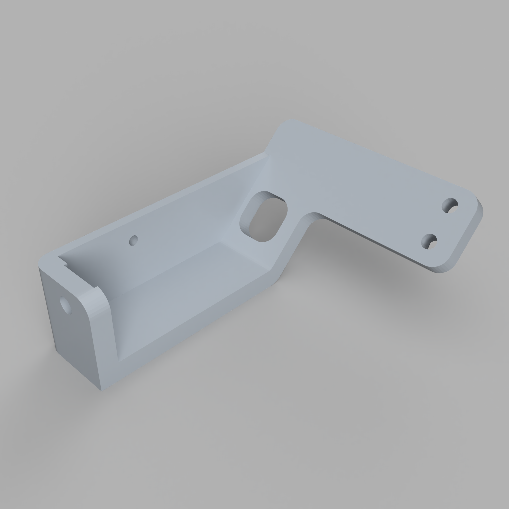

# Title

TODO: Change title
This is a one or two sentence summary of the design documented here.

TODO: Change ALT text
TODO: Add an overall rendered image of design

Please use the [latest released version](https://github.com/cwimmer/CAD-template/releases/latest).  The main branch might have partial changes committed.
TODO: Change link to this repo

## Capabilities required

- Example 1
- Example 2
- Example 3
- TODO: Adjust tools and skills as required

## Table of Contents

- [Readme](README.md) - This file
- [Bill of Materials](BOM.md) - Specifications of parts included in this assembly
- [Assembly Instructions](ASSEMBLY.md) - Assembly Instructions
- [Changelog](CHANGELOG.md) - Chronologically ordered list of notable changes for each version of a project
- [Material Defaults](MATERIAL_DEFAULTS.md) - Descriptions of materials where not otherwise specified.
- [Part Orientation](PART_ORIENTATION.md) - Orientation instructions for 3D printing
- [On Suppliers](ON_SUPPLIERS.md) - Discussion of how to source parts for this assembly
- [Acknowledgements](ACKNOWLEDGEMENTS.md) - Acknowledgements of other authors included either for reference or inspiration
- TODO: Adjust table of contents as needed

## General Notes

1. Unless otherwise specified, dimensions are in millimeters.
2. The CAD diagrams in the CAD directory are the authoritative definition of this assembly.
3. Standard hardware (screws, nuts, washers, T-nuts, etc.) is **not modeled** in the CAD assemblies. Holes, clearances, and interfaces are shown; the fasteners themselves are specified in [`BOM.md`](./BOM.md) and [`ASSEMBLY.md`](./ASSEMBLY.md). If there is ever a conflict, treat `BOM.md` as the source of truth for hardware type and quantity.
TODO: Adjust notes as needed

## License

Unless otherwise noted:

- **All written content and images:** © Charles Wimmer, licensed under [Creative Commons Attribution 4.0 International](https://creativecommons.org/licenses/by/4.0/).
- **All hardware design files (e.g., STL, CAD, PCB):** Licensed under the [CERN Open Hardware License v2 – Strongly Reciprocal](https://ohwr.org/cern_ohl_s_v2.txt).
- **All code and scripts:** Licensed under the [MIT License](https://opensource.org/licenses/MIT).
